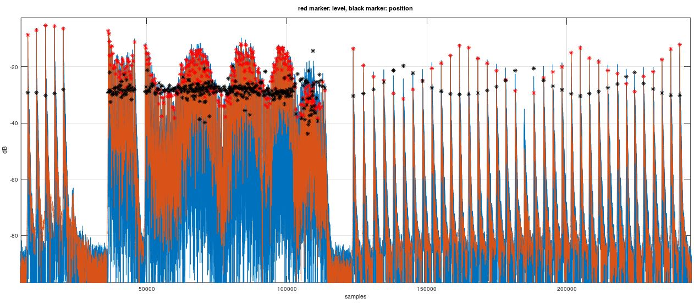

# Drum triggering algorithm

The task to convert a hit on the drum pad with the stick to a MIDI signal consists of mulitple stages.
The first stage is the detection of the position in time of the stick hit. This we call the
__peak detection__. Then we __estimate the velocity of the hit__ using the detected peak. The next
step is to estimate the position of the stick hit on the pad (i.e. if the hit was in the center or
at the edge of the pad). This is called __positional sensing__. Another step is to use the information
of a second piezo sensor to detect if we have a rim shot which leads to a __rim shot detection__. In
this step we can also detect if we have a cross stick situation.

## Peak detection

- If you calculate the power of the recorded real-valued audio signal, the resulting power curve has
  significant power drops caused by the nature of a sinusoidal signal. A filtering can smooth the
  curve. As a possible filter we can use a Hilbert transform to convert the real-valued signal in a
  complex signal. As a result, the magnitude of that complex signal is much smoother already without
  having modified the actual spectrum of the signal (real-valued signals have mirror symmetric spectrum).
  This effect is shown in the following picture:
  

- To improve the peak detection, we can make use of the known decay curve of the trigger pad in use.
  So, after successfully detecting a peak, we know that this peak causes a slowly decaying power
  curve which has a known shape and we can subtract that known curve from the signal to improve the
  detection of the next pad hit.

## Positional sensing

- It has shown that if you hit the pad close to the edge, the resulting sound has less low frequencies
  and sounds more crisp. So, the idea is to low-pass filter the signal and at the detected peak position we
  calculate the power ratio of the low-pass filtered signal with the unfiltered signal. This is then
  the metric for the positional sensing.

# First results

- The following plot shows how the current status of the algorithms performs. At the beginning there are
  some single hits. Then there follows a region with a snare drum roll. After that, there are single hits
  which start from the middle, move to the edge and go back to the middle of the pad where the hits are
  equally strong. As shown by the black markers, the positional sensing seems to work pretty well. Also,
  the peak detection and velocity estimation seems to be pretty good as well.
  

# Latency between pad hit and audio output of the synthesized drum sound

As given in our project specifications, the overall latency should be as small as possible.
The goal is to get a latency < 10 ms. This overall latency consists of:

Time to

- analog-digital convert the analog pad signal,
- process the digital signal with the trigger detection algorithms (filter delays, etc.),
- transmit the MIDI signal,
- create a digital synthesized drum sound signal from the received MIDI signal,
- digital-analg convert the digital signal to get the final audio signal to be played in the loudspeaker or headphone.

If the trigger detection algorithm runs on a microcontroller or DSP and the analog-to-digital conversion
is done on a per-sample bases (i.e. not based on blocks like on a regular audio interface on a PC), this
delay is negligible.

The delay introduced by the trigger detection algorithms is more critical. E.g. if we filter the digital
signal with a FIR filter, this filter will introduce a delay of half the length of the impulse response
used by the FIR filter. So we are restricted in the length of the impulse response to keep the delay low.
The same thing applies to, e.g., moving average filters or scan times. All this introduces delay which we
want to minimize to get to our goal in the project specifications.

The transmission delay of the MIDI signal depends on the channel. If we use the serial communication channel
over USB to transmit the MIDI signal, the delay should be negligible. But if we, e.g., use the bluetooth
of an ESP32 to transmit the MIDI signal, significant delay (about 10 ms) is introduced by this.

The synthesis and digital-to-analog conversion of the drum audio signal shall not be covered by this
project (at least not right now). So, we can ignore this part for now.

## Comparison of e-drum module latencies

According to https://www.vdrums.com/forum/general/the-lounge/1182869-fastest-lowest-latency-drum-module-available and http://onyx3.com/EDLM, the drum modules have the following measured latencies:

- Roland TD-50\30: **3 ms**    (measured by Chris K)
- Roland TD11\15:  **3 ms**    (measured by Chris K)
- Roland TD15:     **3.15 ms** (measured by 30YearsLater)
- Roland TD12:     **3.60 ms** (measured by 30YearsLater)
- Roland TD-20:    **5.7 ms**  (measured by Chris K)
- Roland TD-4:     **3.8 ms**  (measured by onyx3.com)
- Roland TD-17:    **3.6 ms**  (measured by onyx3.com)
- MIMIC:           **4 ms**    (measured by Chris K)

I measured my Roland TDW-20 module by using a stereo splitter cable and connected the trigger output
of my PD-120 pad directly to one channel of my sound card input and also to the trigger input of the
TDW-20 module. Then I connected the analog audio output of the TDW-20 to the other stereo channel of
my sound card and recorded the signal with Audacity. I now measured the latency between the main
peak of the pad trigger to the first peak of the synthesized signal from the TDW-20. As seen in the
screen shot, there is a latency of about **7 ms**:

