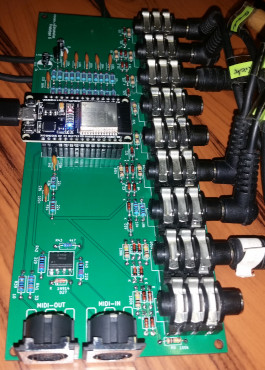
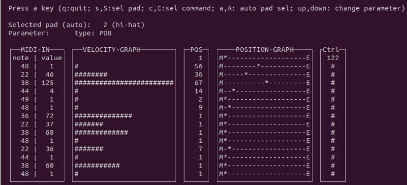
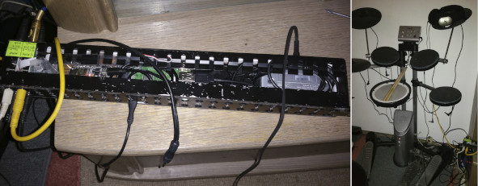
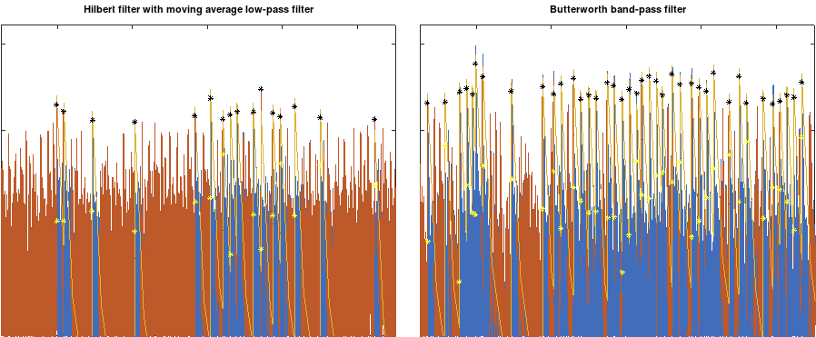
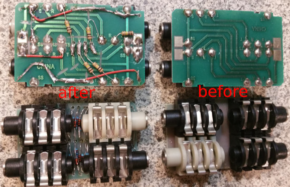
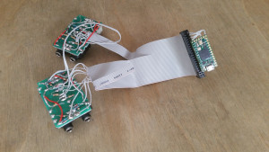
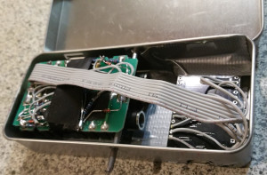
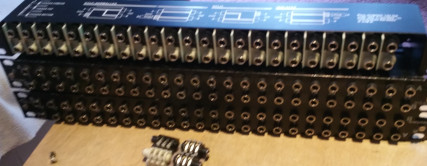

# Edrumulus Project Log


## 2023-01-17 Auto start Edrumulus on Raspberry Pi is not trivial

  To auto start Edrumulus on a Raspberry Pi I tried to use the systemctl with:
  ```
  WorkingDirectory=/home/pi/edrumulus/tools
  Environment="JACK_NO_AUDIO_RESERVATION=1"
  ExecStart=/bin/sh -c 'exec /home/pi/edrumulus/tools/run_edrumulus.sh lcdgui >/var/log/edrumulus1.log 2>/var/log/edrumulus2.log'
  ```
  But that gave me a segmentation fault in Drumgizmo. Only running the service as the pi
  user in rc.local has worked:
  ```
  cd /home/pi/edrumulus/tools
  export JACK_NO_AUDIO_RESERVATION=1
  su pi ./run_edrumulus.sh lcdgui &
  ```

## 2023-01-08 edrumulus_gui.py replaces EdrumulusGUI

  The C++ version of the command line Edrumulus GUI is now replaced by an equivalent Python
  implementation. Now, the LCD-GUI can be merged in that file. Also, the settings file
  management can now be implemented in that file giving us a single source implementation.

## 2022-10-16 Multiple head sensors

  The PDA120LS pad has three mesh head piezo sensors which are combined into one output signal.
  I have modified this pad to output each sensor signal separately. On a Git branch I have
  implemented a proof of concept to utilize the multiple head sensor signals to improve the
  positional sensing and eliminate the hot spot problem. The new positional sensing algorithm
  measures the time difference of the first peak location of all three sensors. The transverse
  wave emitted from a strike travells slower than the speed of sound. The measured time difference
  of 20 cm distance is approx. 2 ms or 16 samples at 8 kHz sampling rate. This is enough to
  measure the position with a good precision.<br/>
  The challenge is to detect the first peak of each sensor correctly. Also, since we process
  each sensor separately, it is important to combine the three peaks correctly. Otherwise we get
  double trigger problems. Another issue is to derive the position from the measured distances.
  Right now I am using a simple approximation. This [Youtube Video](https://youtu.be/HZXtSe5p0rs)
  shows how the algorithm performs.<br/>
  A simple way to eliminate the hot spots is to average the detected velocities of all sensors.
  First tests showed that this works very well. The detected velocity is consistent independent
  on the strike position, i.e., even on the edge of the pad and if a piezo sensor is hit directly.

## 2022-08-18 Edrumulus prototype 5 (advanced Raspberry Pi hat PCB)

  The most advanced Edrumulus prototype up to now was build. It is a Raspberry Pi hat design where
  we use a 4 layer PCB. The PCB layout was optimized for minizing the ESP32 ADC spikes and was
  done by [jstma](https://github.com/jstma) (thank you very much for that!).<br/>
  Prototype 5 features a display/button front panel which is stacked on top of the Edrumulus hat.
  First tests showed an improved performance of this prototype compared to other ESP32 prototypes
  where the spike cancellation could be turned off using the same pad threshold settings and also
  almost no "ghost strikes" were seen in the initial test.
  <br/>

## 2022-08-16 Edrumulus prototype 6 (PCB with audio jacks and DIN5 MIDI ports)

  A new prototype 6 is ready. It uses normal audio jack connectors and features standard DIN-5
  MIDI connectors. The schematics are changed a bit to support a separate voltage regulator
  just for the bias resistors and add some more capacitors to try to reduce the ADC spikes of
  the ESP32. The new MIDI connectors work fine but, unfortunately, the ADC spike reduction was
  not successful. Even with that new design, there are still a lot of spikes visible in the ADC
  readings.<br/>
  Soon, prototype 5 will be ready, too, which uses a much more advanced PCB design to
  eliminate ADC spikes. We will see if that design yields better results.
  <br/>

## 2022-08-06 [[r0.5](https://github.com/corrados/edrumulus/releases/tag/r0_5)] Simple overload correction

  A simple signal overload correction is now supported. The initial idea in the TODO list was to
  use a low-pass filter to recreate the clipped peak value. It is quite challanging to find the
  correct filter parameters like cut-off, latency correction, amplitude correction, etc.
  Therefore, a simpler approach was implemented now. We simply count the number of samples which
  are detected to be clipped and assign these numbers to amplification values for the clipped
  estimated peak value. Since the number of clipped samples might be incorrect because of noise
  or even that not only the main peak is clipped but also the second main peak as well, only a
  maximum of 4 dB is amplified and only the steps 1, 2, 3 and 4 dB are supported.

## 2022-08-03 Edrumulus prototype 4 (Raspberry Pi hat PCB)

  There is a new Edrumulus prototype available which uses a custom PCB created with KiCad and
  is intended to be used as a Raspberry Pi hat. It has a DB-25 trigger connector which is
  compatible to the Roland TD9/TD11/TD15/TD25 multicore cable. The usage as a Raspberry Pi hat
  is optional, i.e., this prototype can be used with a PC using a normal USB cable conntected
  to the ESP32 development board. But make sure **not** to attach it to a Raspberry Pi and connect
  the USB cable at the same time! If the prototype is connected to the Raspberry Pi, it gets
  powered from the Raspberry Pi and this would interfere with the power from the PC via the USB
  cable.<br/>
  Unfortunately, there is a hardware bug which has to be fixed by soldering a capacitor
  to the 3.3V and GND near the kick drum input (see the red circle on the last photo), otherwise
  you get false triggering on that input.
  <br/>

## 2022-07-23 Confusion about the PDA-120LS pad

  My assumption was that all Roland pads with mesh heads do support positional sensing. So, I
  acciently recommended the PDA-120LS for having positional sensing support with Edrumulus.
  After recording a test signal with that pad, I had trouble to find any parameters where the
  positional sensing works at all. Finally, I found out that this pad does not use a center-
  mounted pizeo but three piezos at the edges of the mesh head. That explains why I could not
  get the positional sensing working. So, be careful what kind of mesh head pad you buy if you
  want to have positional sensing.

## 2022-07-02 Youtube video of prototype 3 (HD-1)

  A [Youtube Video](https://youtu.be/tBlKvivwAE4) of Edrumulus prototype 3 (HD-1) is
  now available showing the trigger performance in real action.

## 2022-06-18 Unreliable settings storage on ESP32

  Unfortunately, it seems that the settings storage on the ESP32 does not work as expected.
  On my prototype 3 (HD-1), some settings are not recalled correctly. This especially
  happens if the attached Raspberry Pi must be resetted after, e.g., a freeze. Either the
  sudden power off of the ESP32 is the cause or the Raspberry Pi sends arbitrary MIDI signals
  when it is shut-down. This has to be investigated...

## 2022-01-22 [[r0.4](https://github.com/corrados/edrumulus/releases/tag/r0_4)] Store settings on Edrumulus

  Edrumulus stores all trigger parameter on the micro processor using the Arduino
  EEPROM library now. It is no longer necessary to hard-code pad trigger parameters for
  your prototype in edrumulus.ino. After flashing the new firmware for the first time,
  the settings must be reset. Either use the Linux EdrumulusGUI and press the **r** key
  or use the Octave edrumuluscontrol.m GUI and press the **Reset All Settings** button.

## 2022-01-16 [[r0.3](https://github.com/corrados/edrumulus/releases/tag/r0_3)] New Linux console GUI

  There is a new tool available to show/modify Edrumulus parameters in a Linux (remote) shell
  using the ncurses library. This comes handy if Edrumulus is used with Drumgizmo running on
  a headless Raspberry Pi. This GUI is coded in one single file tools/edrumulus_gui.cpp.
  <br/>

## 2022-01-09 Edrumulus prototype 3 (HD-1)

  Today was the first time I tested Edrumulus in a full drum-kit setup and
  stand-alone (i.e. no PC or Laptop needed). The prototype 3 consists of an
  ESP32 with 7 pad and 1 control inputs, a Raspberry Pi 3 with a 32 GB SD card
  and a Behringer UFO 202 USB audio interface. It worked pretty amazingly well.
  Of course, there is plenty of room for improvement. But for a first try it was
  a great experience. Even positional sensing was possible with the PDX-8
  mesh pad even that it does not have a center mounted piezo trigger.
  <br/>

## 2022-01-09 Possible out-of-memory issue for the ESP32

  Today I flashed the current Edrumulus code on my ESP32 and it immediately crashed. After
  disabling the initialization of the last configured pad it did not crash anymore so, I
  assume that we have an out-of-memory issue for the ESP32.

## 2022-01-08 Hot spot detection for mesh head pads

  I was working on a hot spot detection algorithm on a Git side branch recently. As a reference,
  I have used the piezo signal of a PD-80R and PD120 recorded with a conventional audio card.
  These audio card inputs are usually optimized for low impedence microphones. I developed an
  algorithm which worked fine for these signals but did not work at all for running it in
  real-time on a micro controller. The reason for that is caused by the mismatched input of the
  audio card for piezo signals. The shape of the signal is so different that the algorithm
  did not work at all. A new algorithm and further investigations are needed.

## 2021-12-16 Rim shot detection again

  After fixing a bug with the detection of the first peak and introducing a band-pass filter
  for the rim piezo signal of the PD-80R, the rim shot detection is now acceptable (but still
  far from perfect).

## 2021-12-05 New algorithms ready

  The improved peak detection and positional sensing algorithms are now ready and the code
  was merged from a Git side branch to the main branch. By implementing these improvements,
  the source code was heavily changed. Thus, a lot of fine tuning has to be done to, e.g.,
  tweak the pad parameters for the new algorithms and fix possible new issues.

## 2021-11-21 Time to say goodbye, Hilbert...

  The filtered signal currently used for peak detection is a Hilbert filtered signal with
  a moving average low-pass filter applied to it. The initial motivation for this design
  was to reduce the noise and improve the main lobe energy measurement. It turned out that
  it is advantageous to just use the peak value instead of an average.<br/>
  Therefore, we should use an optimized filter which improves the peak detection. To
  reduce the noise floor, a low-pass filter should still be applied. At the same time, some
  high pass filter should be applied to filter out very low frequency noise caused by, e.g,
  the movement of the pad stand after a hit on the pad. Thus, a Butterworth band-pass filter
  with a pass-band of 40 to 400 Hz was chosen. The shorter the pass-band, the longer the filter
  settle time will be. Since the settle time should be as short as possible, it
  is a trade-off between noise reduction and latency.<br/>
  In the following picture, the current Hilbert filter based design is compared to the new
  Butterworth filter design where the peak detection threshold is tweaked for each scenario
  so that no false peaks are detected in the entire signal:
  <br/><br/>
  It can be seen that the new Butterworth filter design detects more peaks compared to
  the existing Hilber filter design.<br/>
  Note that the investigation and implementation is currently on a Git side branch. It will
  take some time to finish this work until it is ready to be merged on the Git main branch.

## 2021-10-09 Fixing issues and improving positional sensing
  I am currently heavily changing the Edrumulus code on a Git side branch. I found an issue
  with the moving average filter of the Hilbert filter result and also want to improve the
  positional sensing. As soon as these changes are done, the code will be merged onto the
  main Git branch.

## 2021-10-02 PD-80R investigations
  I just found out that on the PD-80R mesh pad the detected MIDI velocity at the
  edge of the pad is much too small compared to the hit with the same force in the middle of
  the pad. The problem is that there is a moving average of 2 ms applied to the signal which
  is used to find the maximum value. If you play a mesh pad at the edge, the main peak is of
  smaller width compared to the peak if you hit the mesh pad in the middle. Therefore, a lot
  more energy is collected with the long moving average filter for the hit in the middle. To
  fix this issue, the moving average could be shortened to, e.g., 0.5 ms. But if this is
  modified, multiple other problems arise like we have to rise the threshold. This is most
  probably caused by the fact that the longer averaging has filtered away small peaks from
  the ADC noise. Also, the retrigger cancellation does not work as good anymore.<br/>
  To solve the issue, one way would be to use the longer moving average filter for the
  threshold detection and a shorter moving average filter for the MIDI velocity detection.

## 2021-09-28 PD-8 positional sensing does not work
  It turned out that the positional sensing algorithm does not work at all for the
  Roland PD-8 rubber pad. Interestingly, it works quite good for the Yamaha TP-80 rubber pad.
  More investigations are needed to find out the cause of the problem.<br/>
  A detailed view of the curcuit board for the jack sockets which are based on the patchbay is
  shown in the following picture:
  <br/>

## 2021-09-19 Some project logs
  - One outstanding serious issue is false triggering in case no pad is played. This may be caused
    by electromagnetic interference like if someone switches a light on or it is caused by the
    microcontroller and its ADC itself.
  - In Edrumulus the start of the Scan Time is defined at the first detected peak. Usually, the
    scan time is defined from the point in time when the input signal crosses the trigger threshold.
    It has shown that if, e.g., the trigger is hit directly, we might get strange effects before the
    main peak so that the signal goes above the threshold earlier than for normal pad hits and as
    a consequence, the scan time would not cover the same amount of the regular peaks as with the
    normal pad hits.
  - For the PD80R, the positional sensing must be improved since sometimes a false first peak is
    detected if the piezo is hit directly with the stick (hot spot).

## 2021-07-17 Adding a cross talk cancellation
  Now an experimental pad cross talk cancellation algorithm is supported in
  Edrumulus. This is useful if pads are attached on the same stand and trigger each other.

## 2021-07-04 Improving ADC spike detection algorithm
  Still too many false detections on the ESP32. The ADC spike detection algorithm
  must be improved. A new algorithm development file "adc_spike_cancellation.m" was created.

## 2021-05-15 Hardware support is stable
  After a lot of tweaking, both boards (ESP32 and Teensy) perform good enough now
  so that I can concentrate on the algorithm development again. On the Teensy, I had to disable
  the "keeper" and average multiple ADC samples to get correct and spike free readings. Since
  the ARM core is so fast, there were no problems running the algorithms in real time.<br/>
  For the ESP32 the situation is different. The CPU speed was the limiting factor for a long time.
  Fortunately, I found out that it is possible to run the ADC processing on one CPU core and
  do the signal processing on a different CPU core. That solved the speed issue. I did not find
  a way to suppress the ADC spikes on the ESP32 but I solved the problem in software with a spike
  cancellation algorithm. This solution is not ideal (especially for low velocity hits the
  performance is degraded) but still good enough.

## 2021-05-09 Teensy 4.0 versus ESP32
  There is a new prototype, now using a Teensy 4.0 developer board:
  <br/><br/>
  Difference between ESP32 and Teensy 4.0 with regard to Edrumulus:
  Feature | ESP32 | Teensy 4.0
  --- | --- | ---
  #ADC inputs | 18 | 14
  FPU | yes | yes (better performance than ESP32)
  Speed | 240 MHz dual core | 600 MHz single core
  ADC | 2 ADCs, a lot of spikes | 2 ADCs, less spikes (but still some smaller spikes visible)
  USB MIDI | over serial, needs Hairless MIDI or ttyMidi | shows up as USB MIDI device
  Debugging | either serial debugging or MIDI | MIDI and debugging can be done in parallel
  Cost | ~10 € | ~20 €

## 2021-05-02 Prototype 1 on Youtube
  Here is link to a Youtube video of the new Prototype 1 in action: https://youtu.be/UKeuFm_DDTk
  <br/>I was running [Drumgizmo](https://drumgizmo.org) under Linux on my Laptop with the
  [The Aasimonster](https://drumgizmo.org/wiki/doku.php?id=kits:the_aasimonster) drum kit where the
  snare samples were replaced by Tama Artstar snare samples which support positional sensing.

## 2021-05-01 Minimal drumset prototype
  There is another Edrumulus prototype which is a minimal
  drumset with kick/snare/hi-hat:
  <br/>

## 2021-04-10 Prototype
  Here is what my current Edrumulus prototype looks like:
  <br/>

## 2021-04-04 ADC spikes of the ESP32
  This is how the ESP32 ADC signal looks like:
  <br/><br/>
  These spikes seem to be a hardware restriction of the ESP32. I am trying to mitigate this
  effect by implementing a spike suppression algorithm.

## 2021-04-03 Using our own analogRead implementation
  The Edrumulus now implements its own analogRead function so we can use
  the newest arduino-esp32 library version (which is 1.0.6 at present time).

## 2021-04-01 Speed tests
  Some speed tests with 6 pads:
  Everything + adc1_get_raw call: **0.368 ms**, Everything: **0.1162 ms**, Without process sample: **0.077 ms**,
  Without analogRead: **0.0455 ms**.<br/>
  Conclusion: The new ESP32 Arduino Library now [uses the IDF driver](https://github.com/espressif/arduino-esp32/pull/3377)
  which is basically the adc1_get_raw function which is very slow as seen in my speed tests. My speed tests also
  showed that the bottle neck is the analog read.

## 2021-03-24 Measurements of hi-hat controllers
  Measurements of hi-hat controllers:
  **VH-12 controller:** open **14 kOhm**, closed **10 kOhm**, pressed **8 kOhm**,
  **FD-8 controller:**  open **50 kOhm**, closed **0 Ohm**.

  **VH-12 MIDI on Roland TD-27**:
  - Strike on the top:
    - MIDI note 42 only at foot pedal MIDI note 127.
    - MIDI note 46 if foot pedal MIDI note is < 127.
  - Strike on the edge:
    - MIDI note 22 only at foot pedal MIDI note 127.
    - MIDI note 26 if foot pedal MIDI note is < 127.

  **FD-8 on Roland TD-6**:
  - Strike on the top:
    - MIDI note 42 if foot pedal MIDI note is >= 85.
    - MIDI note 46 if foot pedal MIDI note is < 85.

## 2021-03-23 Issue with Arduino board manager for ESP32
  I just updated the Ardunio board manager "ESP32 by Espressif Systems" to Version
  1.0.5 and now the code runs much slower on the ESP32 module so that I cannot even run just one
  pad with 8 kHz sampling rate anymore. So I had to revert the board manager version to 1.0.4. I
  hope that with the next board manager update this issue will be fixed and we get back to the
  normal speed on the hardware. For the time being I will stick to version 1.0.4.

## 2021-03-20 Improving retrigger cancellation algorithm
  The retrigger cancellation algorithm is now improved. The decay power is now estimated
  and the decay curve adjusted accordingly. I also bought three used patchbays which have a lot of
  jack sockets which can be used as trigger inputs.
  <br/>

## 2021-02-05 Using Drumgizmo
  I am currently evaluating the great [Drumgizmo](https://drumgizmo.org) software
  to be used in conjunction with Edrumulus. I am in contact with the [main developer](https://drumgizmo.org/wiki/doku.php?id=team) and have
  already written some code to [support ALSA MIDI in Drumgizmo](https://linuxmusicians.com/viewtopic.php?f=56&t=22714).
  I am currently trying to run Drumgizmo on a Raspberry Pi zero but I assume that I will
  need at least a Raspberry Pi 4 to get a decent performance.

## 2021-01-24 Rim shot detection done
  Rim shot detection is now ready but does not yet perform as good as the reference
  Roland TD-20 module. Anyway, by just rotating my PD-120 pad so that I hit the rim approximately
  at the position where the jack plug is located, the rim shot detection works much better now
  since the rim shot piezo is also located close to the jack plug.

## 2021-01-19 Rim shot detection development
  Still working on the rim shot detection using the PD-120 pad. It turns out to be very
  difficult to get a reliable rim shot detection. So, it will take some more time to solve this problem.

  The current project plan is to continue working on making the PD-120 triggering as good as possible.
  If possible, I would like to compare the performance of Edrumulus to the TD-20 by capturing the piezo
  signal together with the MIDI output of the TD-20.

  If the PD-120 triggering is ready, I'll start to support other pad types like the PD-80R and the PD-6.
  Then support kick trigger pads like the KD-8. Finally, the hi-hat/crash/ride pads shall be supported.

## 2020-12-22 Testing BLE MIDI
  Just tested BLE MIDI (i.e. MIDI over bluetooth). I could successfully connect to GarageBand
  on an iPhone. Unfortunately, the bluetooth connection caused some interference in the audio input signal
  so that the threshold had to be increased and also we got a lot of false detections on low velocity hits
  at the edge of the pad. So for future hardware designs some shielding should be considered. Also, I started
  looking at the second piezo signal to support rim shot detection.

## 2020-12-20 Support positional sensing on an ESP32
  The positional sensing algorithm is now also ported to the ESP32 micro controller. I have made a
  new Youtube video using the current implementation (Git commit c796369): https://youtu.be/naP-ODXl9Y0

## 2020-12-18 Running initial algorithms on an ESP32
  I have ported the Octave peak detection code to the ESP32 developer board (a DOIT ESP32 DEVKIT V1,
  no positional sensing yet) and connected it via my PC and Hairless MIDI to my Roland TD-20 module so that
  the snare sound was coming out of the TD-20. This time I could test the performance in real-time. The parameters
  were not yet optimized but still, the results were very promising. Without positional sensing, the ESP32 runs at
  about 56 kHz sampling rate when calculating the peak detection algorithm on one pad. Since I only need 8 kHz
  sampling rate (maybe even 4 kHz is sufficient), we have a lot of headroom for the positional sensing algorithm
  or to add rim shot support and support multiple pads.

## 2020-12-13 Initial algorithm tests
  I am very pleased about the current algorithm performance. The algorithm is not yet fine-tuned but
  already performs pretty well. I have created a short Youtube video of the algorithm (Git commit c83743e) to show
  the current performance in action: https://youtu.be/6eQjCD-DFjo

  The following plot shows how the current status of the algorithms performs. At the beginning there are
  some single hits. Then there follows a region with a snare drum roll. After that, there are single hits
  which start from the middle, move to the edge and go back to the middle of the pad where the hits are
  equally strong. As shown by the black markers, the positional sensing seems to work pretty well. Also,
  the peak detection and velocity estimation seems to be pretty good as well.
  <br/>

